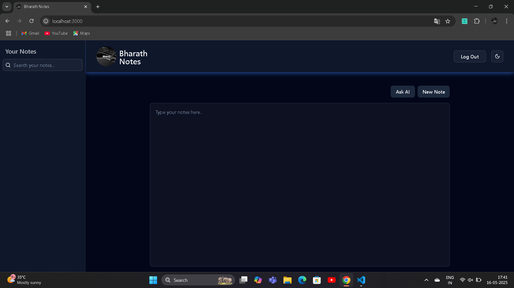
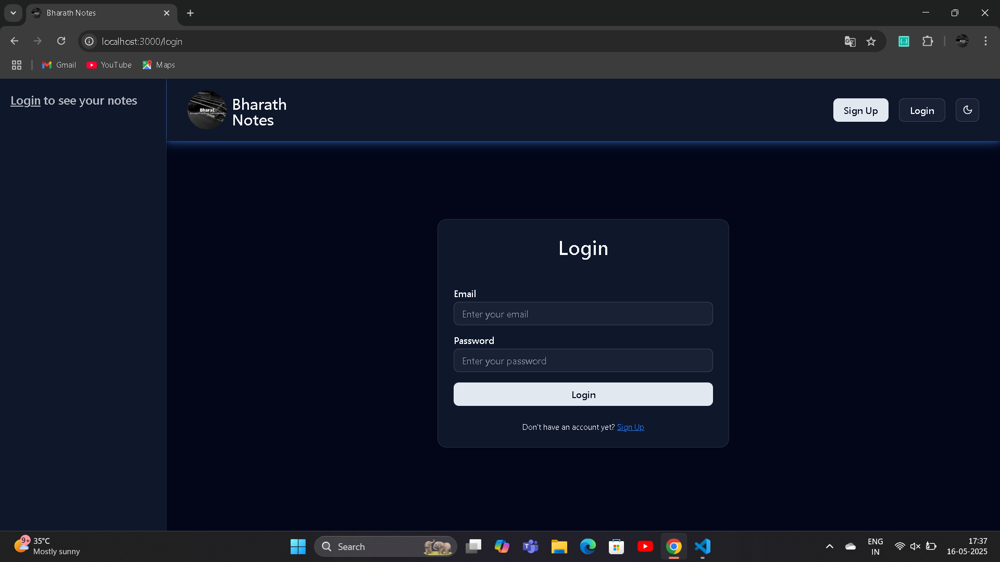
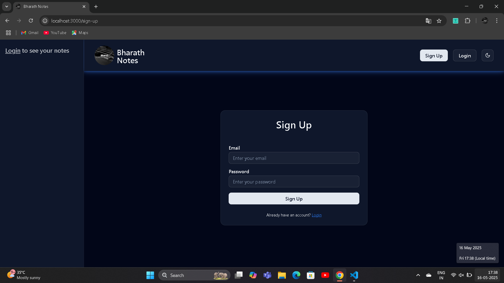
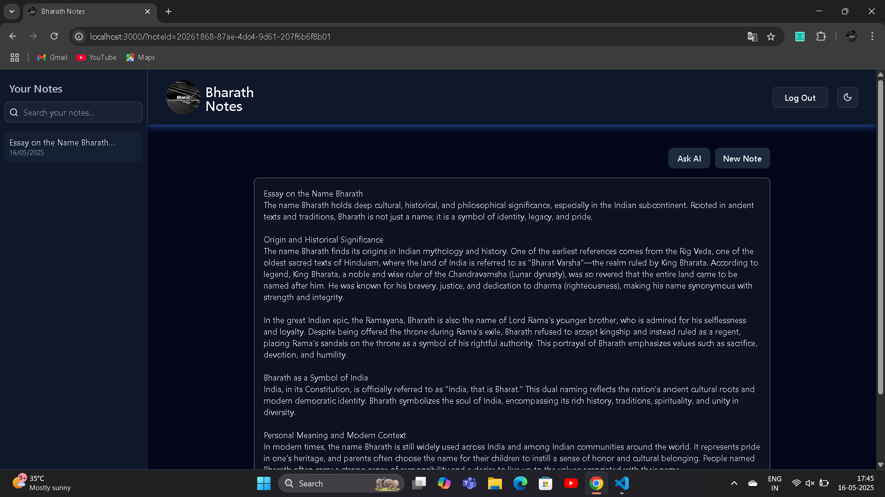
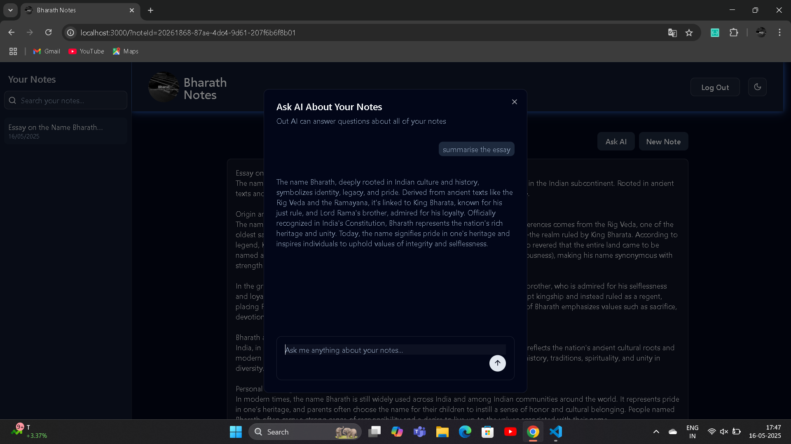

# 📝 Bharath Notes – AI-Powered Note Taking

A modern, AI-powered note-taking application built with **Next.js**, **Supabase**, and **Gemini AI**. Bharath Notes helps users create, organize, and enhance notes with real-time syncing, markdown editing, and intelligent suggestions.

## 📸 Screenshots

| AI-Enhanced Dashboard                     |
| ----------------------------------------- |
|  |

| Login                              |
| ---------------------------------- |
|   |

| SignUp                             |
| ---------------------------------- |
| |

| Notes                              |
| ---------------------------------- | 
|   |

| AskAI                               |
| ----------------------------------- |
|    |

## 🚀 Features

* ✨ **Gemini-Powered AI**: Summarize, rewrite, and generate content.
* 🔐 **Secure Auth**: Supabase authentication with real-time RLS policies.
* 📝 **Markdown Editor**: Simple and clean note editing experience.
* 🗃️ **User-Specific Notes**: Notes are securely stored and scoped per user.
* 🌙 **Dark Mode**: Sleek UI that adapts to light and dark themes.
* 🔄 **Live Syncing**: Notes auto-update in real time.
* 🧠 **AI Tagging and Assistance**: Generate tags and summaries intelligently.

---

## 📁 Project Structure

```
src/
├── actions/         # Server actions for note operations
├── app/             # App routing and page components
├── auth/            # Authentication logic and components
├── components/      # UI and reusable components
├── db/              # Supabase DB client and RLS logic
├── gemini/          # Google Gemini API integration
├── hooks/           # Custom React hooks
├── lib/             # Utilities (e.g., auth, helpers)
├── providers/       # Context and theme providers
├── styles/          # Global and modular styles
└── middleware.ts    # Middleware for route handling
```

Other root-level files:

* `.env.local` – Environment variables
* `components.json` – shadcn/ui registry
* `.gitignore`, `.prettierrc`, `eslint.config.mjs`, `tsconfig.json`, `next.config.ts` – Config files

---

## 🛠️ Tech Stack

| Layer    | Tech                                        |
| -------- | ------------------------------------------- |
| Frontend | Next.js 15+ (App Router), React, TypeScript |
| Styling  | Tailwind CSS, shadcn/ui                     |
| Backend  | Supabase (PostgreSQL + Auth)                |
| AI       | Google Gemini API                           |
| Hosting  | Vercel                                      |

---

## 🌐 Live Demo

👉 [**Live Site**](https://your-deployed-app-url.com)

---

## 🔧 Getting Started

### 1. Clone & Install

```bash
git clone https://github.com/bharathpasupuleti116/bharath-notes.git
cd bharath-notes
pnpm install
```

### 2. Setup Environment Variables

Create `.env.local` in the root:

```env
NEXT_PUBLIC_SUPABASE_URL=your_supabase_url
NEXT_PUBLIC_SUPABASE_ANON_KEY=your_supabase_anon_key
GEMINI_API_KEY=your_gemini_api_key
```

### 4. Run the Dev Server

```bash
pnpm dev
# Visit: http://localhost:3000
```

---

## 🧠 AI Capabilities (Gemini)

Gemini is integrated via the `/src/gemini/` module to assist with:

* Note **summarization**
* **Content generation** from prompts
* Auto **tagging** and classification
* Future: outline generation, Q\&A, and semantic search

---

## 🙋‍♂️ Author

**Bharath Kumar Pasupuleti**
📧 [Email](bharathpasupuleti116@gmail.com)
🔗 [LinkedIn](https://www.linkedin.com/in/bharathkp1)
📂 [GitHub](https://github.com/bharathpasupuleti116)
